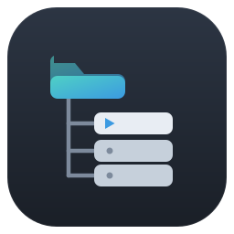
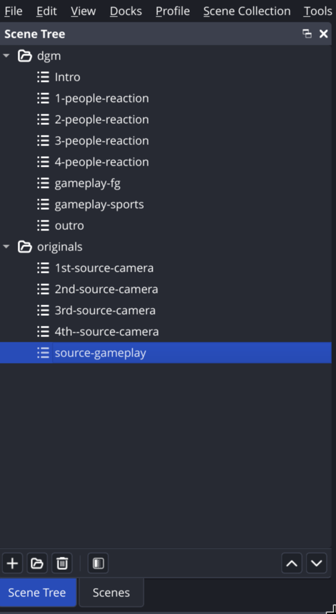
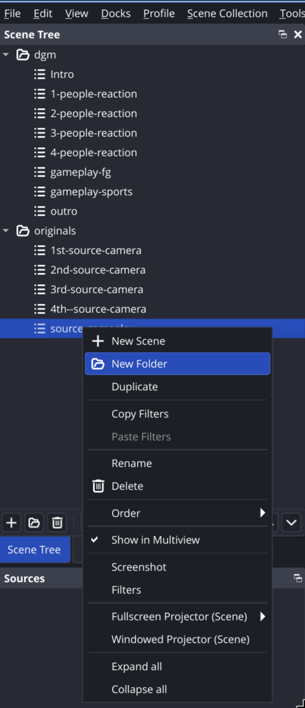

<p align="center">
  
</p>

# Scene Tree dock for OBS Studio

[](https://github.com/jcocano/obs-scene-tree/actions/workflows/push.yaml)
[](https://github.com/jcocano/obs-scene-tree/releases)
[](https://buymeacoffee.com/jesuscocana)
[](LICENSE)

A native OBS Studio plugin that adds a **folder tree dock** for organising your
scenes. OBS keeps scenes in a single flat list; **obs-tree** lets you group them
into nested folders and reorder everything by drag & drop, while clicking a scene
still switches to it exactly like the built-in list.

It looks and feels like a part of OBS — minimalist, native, non-disruptive.

> ☕ If obs-tree makes your streaming setup tidier, you can
> **[buy me a coffee](https://buymeacoffee.com/jesuscocana)**. It's optional, but
> it keeps the project alive and very much appreciated.

---

## Screenshots

<p align="center">
  
  &nbsp;&nbsp;&nbsp;
  
</p>

<p align="center"><em>Nested folders with a live-highlighted active scene (left) and the native right-click menu (right).</em></p>

## Features

- **Custom dock** registered with the modern `obs_frontend_add_dock_by_id` API
  (appears under the *Docks* menu).
- **Folders** — create, rename, nest, and delete. Deleting a folder re-homes its
  contents; it **never** deletes your scenes.
- **Drag & drop** to move scenes between folders and reorder them. Folders are the
  only valid drop targets; scenes are leaves.
- **Live sync** with OBS: scene add / remove / rename and active-scene changes are
  reflected immediately via the frontend event callback.
- **Stable identity** — scenes are tracked by source UUID (`obs_source_get_uuid`),
  so renaming a scene never loses its place in the tree.
- **Per-collection persistence** — the folder layout is stored *inside the active
  scene collection*, so it travels with the collection.

## Requirements

- **OBS Studio 30 or newer** (built against the OBS 31.x / Qt 6 frontend API; works
  on OBS 32.x).
- Windows, macOS, or Linux.

## Install (no compiling)

Prebuilt packages for **Linux, Windows and macOS** are published on the
[Releases](https://github.com/jcocano/obs-scene-tree/releases) page, built
automatically by CI for every tagged version. In every case, **restart OBS**
afterwards and enable the *Scene Tree* dock from the *Docks* menu.

### Windows

- **Easiest — installer:** download `obs-tree-<ver>-windows-x64.exe` and double-click
  it. It installs into your OBS per-user plugins folder automatically (no admin
  rights, nothing to drag around).
- **Manual — zip:** download `obs-tree-<ver>-windows-x64.zip`, open it, and copy the
  `obs-tree` folder into `%AppData%\obs-studio\plugins\` so you end up with
  `%AppData%\obs-studio\plugins\obs-tree\bin\64bit\obs-tree.dll` and the matching
  `…\obs-tree\data\` folder. (An `INSTALL.txt` inside the zip repeats these steps.)

### macOS

Download `obs-tree-<ver>-macos-universal.pkg` and open it — the installer copies the
plugin into `~/Library/Application Support/obs-studio/plugins/` for you.

### Linux

- **Debian/Ubuntu:** `sudo apt install ./obs-tree-<ver>-x86_64.deb`
- **Other distros:** extract `obs-tree-<ver>-x86_64.tar.xz` into
  `~/.config/obs-studio/plugins/`.

> **Unsigned builds.** The binaries are not code-signed yet, so the OS may warn you:
> - **Windows** — SmartScreen prompt → *More info → Run anyway*.
> - **macOS** — right-click the `.pkg` → *Open* the first time, or run
>   `xattr -dr com.apple.quarantine <file>.pkg` to clear the Gatekeeper flag.

## How it works

| Concern            | API used                                                    |
|--------------------|-------------------------------------------------------------|
| Dock registration  | `obs_frontend_add_dock_by_id` / `obs_frontend_remove_dock`  |
| Scene enumeration  | `obs_frontend_get_scenes`                                   |
| Switch scene       | `obs_get_source_by_uuid` + `obs_frontend_set_current_scene` |
| Stable scene key   | `obs_source_get_uuid`                                       |
| Live updates       | `obs_frontend_add_event_callback`                          |
| Save / load layout | `obs_frontend_add_save_callback` + `obs_frontend_save`      |

The layout is serialised under an `"obs-tree"` object in the scene collection's
save data:

```json
"obs-tree": {
  "version": 1,
  "roots": [
    { "type": "folder", "name": "Intro", "expanded": true,
      "children": [ { "type": "scene", "uuid": "…", "name": "Starting Soon" } ] },
    { "type": "scene", "uuid": "…", "name": "Just Chatting" }
  ]
}
```

## Building from source

This project uses the official
[OBS plugin template](https://github.com/obsproject/obs-plugintemplate) build
system. CMake presets drive per-OS builds; CI downloads pinned OBS + Qt6
dependencies (see `buildspec.json`).

```sh
cmake --preset ubuntu-x86_64      # or: macos / windows-x64
cmake --build --preset ubuntu-x86_64
```

### Local dev loop (Linux)

To iterate against your own OBS install, build the `dev-install` target — it copies
the module + `data/` into OBS's portable plugin dir (no root needed):

```sh
cmake --preset ubuntu-x86_64
cmake --build build_x86_64 --target dev-install   # -> ~/.config/obs-studio/plugins/obs-tree/
```

Then **restart OBS** (plugins load at startup, not hot-reloaded) and enable the
*Scene Tree* dock. Override the destination with `-DOBS_PLUGIN_DESTINATION=/path`.

## Project layout

```
src/plugin-main.cpp       module entry: register/unregister the dock
src/scene-tree.{hpp,cpp}  QTreeWidget subclass with drag & drop rules
src/scene-tree-dock.*     dock UI, OBS sync, persistence
src/icons.{hpp,cpp}       SVG icons
data/locale/*.ini         translations (en-US, es-ES)
.github/workflows/        cross-platform CI/CD (Linux, Windows, macOS)
```

## Support

If this plugin is useful to you, the best ways to help are:

- ⭐ **Star the repo** so others can find it.
- 🐛 **Report bugs or request features** via [Issues](https://github.com/jcocano/obs-scene-tree/issues).
- ☕ **[Buy me a coffee](https://buymeacoffee.com/jesuscocana)** to support continued development.

## License

Released under the **GNU General Public License v2.0** — see [LICENSE](LICENSE).
Copyright © 2026 jcocano. This is compatible with OBS Studio / libobs (GPLv2+).

This plugin was developed with the assistance of AI coding tools (used as a
copilot); all design decisions, review and testing are the author's.

## Releasing (maintainers)

Push a semantic-version tag to `main` and CI builds all three platforms and drafts
a GitHub Release with the packages attached:

```sh
git tag 0.1.0 && git push origin 0.1.0
```

Review the draft under [Releases](https://github.com/jcocano/obs-scene-tree/releases)
and publish it.
